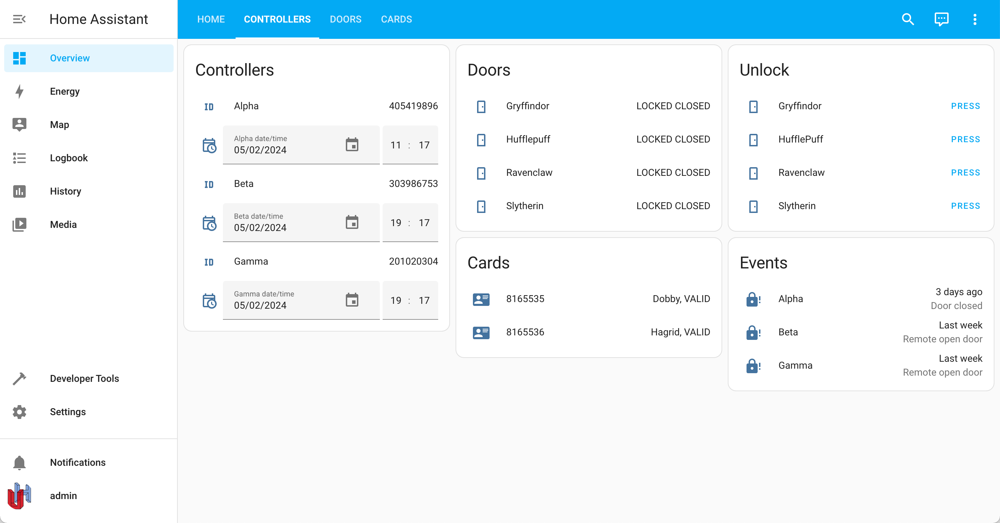
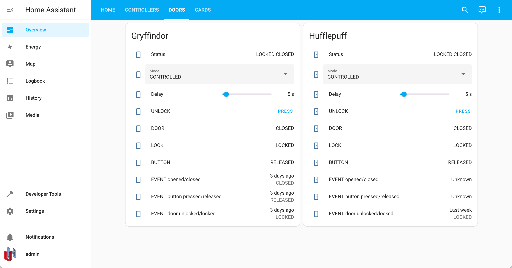
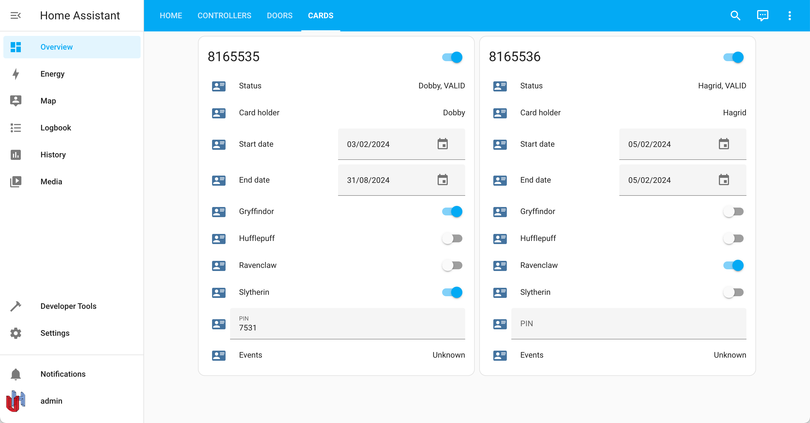

# uhppoted-app-home-assistant

UHPPOTE controller custom component for Home Assistant.

Development status: _ALPHA_

---
_uhppoted-app-home-assistant_ is an experimental _Home Assistant_ custom component for the UHPPOTE access controllers,
leveraging the [_uhppoted-python_](https://github.com/uhppoted/uhppoted-python) library. It turns out that an access
control system has quite a lot more moving parts than e.g. your average thermostat, and the current implementation, 
although functional and usable, is intended more for the (brave) early adopter.

The current version is most suited to a small'ish home ACS i.e. a couple of controllers with half a dozen
doors and maybe a ten or so access cards - so, not a large mansion or an office building.

**Contents**
1. [Screenshots](#screenshots)
2. [Installation](#installation)
    - [Alpha release](#alpha-release)
    - [Development version](#development-version)
3. [Configuration](#configuration)
    - [Entities](#entities)
       - [controllers](#controllers)
       - [doors](#doors)
       - [cards](#cards)
4. [Service API](#service-api)
   - [`unlock-door`](#unlock-door)
   - [`add-card`](#add-card)
   - [`delete-card`](#delete-card)


---
**Screenshots**



---


---


## Installation

### Alpha Release

**NOTE**: The _Alpha_ release is a first release and is entirely **use at your own risk/discretion**. It has had
**very limited** testing - you probably won't lock yourself out of your own home (_unless of course it's late at
night and pouring with rain, in which case it's inevitable_) but please do have a backup plan (which may or may
not include a fire axe). It is also reasonably likely that future releases may require you to reconfigure your
system again i.e. it is for the brave and adventurous who like living on the edge.

The installation below is entirely manual and installs the project as a _Home Assistant_ _custom component_.


1. Create the `config/custom_components` subdirectory under the _Home Assistant_ folder (if it does not already
   exist) and create the `__init.py__` file:

```
cd <Home Assistant>
mkdir -p config/custom_components
touch config/custom_components/__init.py__
```

2. Download the _.tar.gz_ archive from the [_Releases_]() section of the repository (or the most recent [nightly build](https://github.com/uhppoted/uhppoted-app-home-assistant/actions/workflows/alpha.yaml)) and extract it to the `config/custom_components` folder under 
the _Home Assistant_ folder, e.g.:

```
cd <Home Assistant>
cd config/custom_components
tar xvzf uhppoted-app-homeassistant.tar.gz .
```
3. (Optionally), add the default configuration to the `configuration.yaml` file in the `config` folder of
   _Home Assistant_, e.g.:
```
...
uhppoted:
    bind_address: 192.168.1.100
    broadcast_address: 192.168.1.255:60000
    listen_address: 192.168.1.100:60001
    timezone: LOCAL
    debug: false
    max_cards: 10
    preferred_cards: 10058400, 10058401
    card_PINs: false
    controllers_poll_interval: 30
    doors_poll_interval: 30
    cards_poll_interval: 30
    events_poll_interval: 30
...
```

4. Start (or restart) _Home Assistant_ and confirm there are no errors in the logs.

5. Configure your UHPPOTE controllers:
   - Open the _Settings_ page
   - From the _Settings_ page, open the _Devices and Services_ page
   - Click on the _Add Integration_ button
   - Search for _uhppoted_
   - Step through the configuration flow to set up the initial system configuration
   - Add the entities to cards on the desktop (an example is show below)


### Development Version

The suggested installation for the development version installs the cloned project as a symbolic link under the 
_Home Assistant_ `config/custom_components` folder. Be warned - the development version changes almost daily and
is completely NOT guaranteed to be any kind of stable. You could quite conceivably lock yourself out of your 
apartment, your house, the planet or possibly the entire galaxy. At the very least expect to have to reconfigure
your system often. You have been warned :-). 

1. Clone the _uhppoted-app-home-assistant_ repo to a folder that is **NOT** _under_ the _Home Assistant_ folder, e.g.:

```
cd ~/experimental-stuff
git clone https://github.com/uhppoted/uhppoted-app-home-assistant
```

2. Create the `config/custom_components` subdirectory under the _Home Assistant_ folder, if it does not already
   exist and create the `__init.py__` file:

```
cd <Home Assistant>
mkdir -p config/custom_components
touch config/custom_components/__init.py__
```

3. Create a symbolic link to the _uhppoted-add-home-assistant_ folder in the `config/custom_components` folder.

```
ln -s ~/experimental-stuff/uhppoted-app-home-assistant/custom_components/uhppoted config/custom_components/uhppoted
```

(for _Windows_ users: https://superuser.com/questions/1020821/how-can-i-create-a-symbolic-link-on-windows-10)


4. (Optionally), add the default configuration to the `configuration.yaml` file in the `config` folder of
   _Home Assistant_, e.g.:
```
...
uhppoted:
    bind_address: 192.168.1.100
    broadcast_address: 192.168.1.255:60000
    listen_address: 192.168.1.100:60001
    timezone: LOCAL
    debug: false
    max_cards: 10
    preferred_cards: 10058400, 10058401
    card_PINs: false
    controllers_poll_interval: 30
    doors_poll_interval: 30
    cards_poll_interval: 30
    events_poll_interval: 30
...
```

## Configuration

1. Open the _Home Assistant/Settings_ page.
2. Open the _Devices & Services_ page.
3. Select the _Integrations_ tab and then select _Add integration_.
4. Search for _uhppoted_ and open the _uhppoted_ custom integration item.
5. Enter the bind, broadcast, listen addresses and (optionally) enable debug.
6. Select the controllers to manage with _Home Assistant_ from the list of controllers found on the LAN.
7. For each controller:
   - choose a unique name e.g. _Main_, _Controller #1_, etc.
   - (optionally) set the controller IP address
   - (optionally) set the controller timezone (defaults to _Local_)
8. For each controller, select the doors to manage with _Home Assistant_
9. For each selected door:
   - choose a unique name e.g. _Entrance_, _Garage_, _Man Cave_
10. Select the cards to be managed by _Home Assistant_ from the list of cards found on the controllers
11. For each selected card:
   - enter the name of the person (or other entity) using that card
12. On completion of configuration the _uhppoted_ service will create all the entities for the controllers, doors and
    cards.
13. Add selected information to the dashboard from the entities listed below.
   
### Entities

#### Controllers

1. `uhppoted.controller.{controller}.info`
2. `uhppoted.controller.{controller}.datetime`
3. `uhppoted.controller.{controller}.event`


#### Doors

1.  `uhppoted.door.{door}.info`
2.  `uhppoted.door.{door}.open`
3.  `uhppoted.door.{door}.lock`
4.  `uhppoted.door.{door}.button`
5.  `uhppoted.door.{door}.mode`
6.  `uhppoted.door.{door}.delay`
7.  `uhppoted.door.{door}.unlock`
8.  `uhppoted.door.{door}.open.event`
9.  `uhppoted.door.{door}.button.event`
10. `uhppoted.door.{door}.unlocked.event`

#### Cards

1. `uhppoted.card.{card}.info`
2. `uhppoted.card.{card}.cardholder`
3. `uhppoted.card.{card}.start-date`
4. `uhppoted.card.{card}.end-date`
5. `uhppoted.card.{card}.{door}`
6. `uhppoted.card.{card}.pin`
7. `uhppoted.card.{card}.swipe.event`


## Service API

### `unlock-door`

Unlocks a door by name - the name is case- and space-insensitive.

Example:
```
service: uhppoted.unlock_door
data:
  door: Gryffindor
```

### `add-card`

Adds a card to all the controllers configured by the _uhppoted_ service. The card is **not** added to
the list of configured cards - to include the card in the managed cards, open the `CONFIGURE` section 
for the _uhppoted_ service (under _Settings/Devices & Services/uhppoted_).

Example:
```
service: uhppoted.add_card
data:
  card: 10058400
```

### `delete-card`

Delets a card from all the controllers configured by the _uhppoted_ service. The card is **not** removed
from the list of configured cards - to remove the card from the managed cards, open the `CONFIGURE` section 
for the _uhppoted_ service (under _Settings/Devices & Services/uhppoted_).

Example:
```
service: uhppoted.delete_card
data:
  card: 10058400
```
