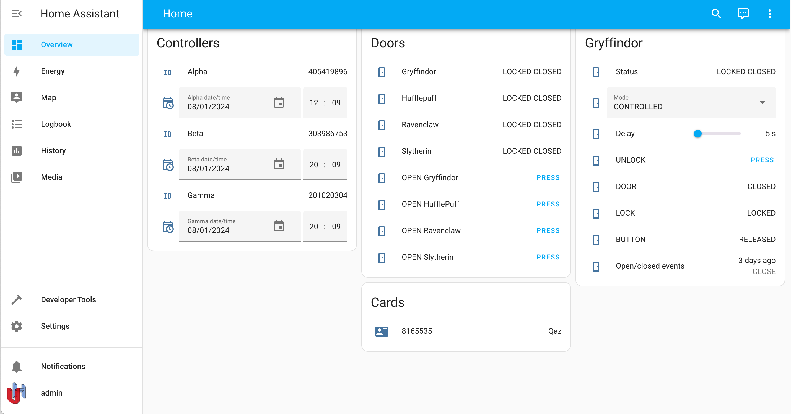

# uhppoted-app-home-assistant

UHPPOTE controller HACS integration for Home Assistant.

(_IN DEVELOPMENT_)

1. [Installation](#installation)
    - [Development version](#developmnet-version)

2. [Configuration](#configuration)



## Installation

### Manual install

### Alpha Release

### Development Version

The suggested installation for the development version installs the cloned project as a symbolic link under the 
_Home Assistant_ `config/custom_components` folder. Be warned - the development version changes almost daily and
is completely NOT guaranteed to be any kind of stable. You could quite conceivably lock yourself out of your 
apartment, your house, the planet or possibly the entire galaxy. At the very least expect to have to reconfigure
your system often. You have been warned :-). 

1. Clone the _uhppoted-app-home-assistant_ repo to a folder that is **NOT* _under_ the _Home Assistant_ folder, e.g.:

```
cd ~/experimental-stuff
git clone https://github.com/uhppoted/uhppoted-app-home-assistant
```

2. Create the `config/custom_components` subdirectory under the _Home Assistant_ folder, if it does not already
   exist and create the `__init.py__` file:

```
cd <Home Assistant>
mkdir -p config/custom_components
touch config/custom_components/__init.py__
```

3. Create a symbolic link to the _uhppoted-add-home-assistant_ folder in the `config/custom_components` folder.

```
ln -s ~/experimental-stuff/uhppoted-app-home-assistant/custom_components/uhppoted config/custom_components/uhppoted
```

(for _Windows_ users: https://superuser.com/questions/1020821/how-can-i-create-a-symbolic-link-on-windows-10)


4. (Optionally), add the default configuration to the `configuration.yaml` file in the `config` folder of
   _Home Assistant_, e.g.:
```
...
uhppoted:
    bind_address: 192.168.1.100
    broadcast_address: 192.168.1.255:60000
    listen_address: 192.168.1.100:60001
    debug: false
...
```

## Configuration
